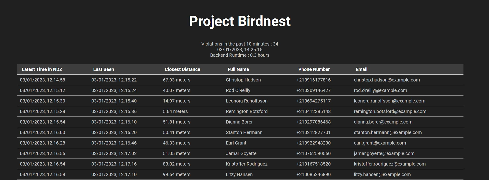

# Project Birdnest
This is my answer for the BIRDNEST assignment by Reaktor.
# Goals
The goals of the birdnest project is as stated by the instructions.
> Build and deploy a web application which lists all the pilots who recently violated the NDZ perimeter.

Additionally instructions are  : 

    * Persist the pilot information for 10 minutes since their drone was last seen by the equipment
    * Display the closest confirmed distance to the nest
    * Contain the pilot name, email address and phone number
    * Immediately show the information from the last 10 minutes to anyone opening the application
    * Not require the user to manually refresh the view to see up-to-date information

This application aims to meet these requirements. 
# Architecture
I use a python based FastAPI backend to handle the database. 
This backend consists of three files.
* api.py -> fastapi to allow the web app to access the database
* reaktorAPI.py -> handles interacting with the reaktor api
* database.py -> interacts with the database to store, remove, and edit information. It does all the calculations for the web app, that then accesses these database files.

The database uses two files in the .csv format, these are:
    
    drones.csv -> 
    [serialNumber,model,manufacturer,mac,ipv4,ipv6,firmware,positionX,positionY,altitude,lastSeen, closestPosition x, closestPosition y]
    pilots.csv -> 
    [name,phone,email,droneSerialNumber,lastViolation,lastSeen,closestPosition x,closestPosition y]

The database does not persist drone information and I do not use the live feed in this project. It could however quite easily be used to show live positions of drones as future development. This is why it is included in the api as /drones.

The web app consists of a basic html, css and js setup with no additional used javascript frameworks. 
# Dependencies
The backend requires a python installation with fastapi, in addition to uvicorn. 

These can be installed with 
> pip install fastapi

and
> pip install "uvicorn[standard]"

The frontend does not require any dependencies for local usage. 
# Running
For local usage just start the backend with 
> uvicorn api:app --port 8001 

in the /Backend folder.
Then open the index.html file in your browser.

If the intended use case is to publish the web app, that can be done with nginx, I have included it and it can be started by running nginx.exe. Be sure to check the readme.md in /nginx for more information.
# Screenshot
